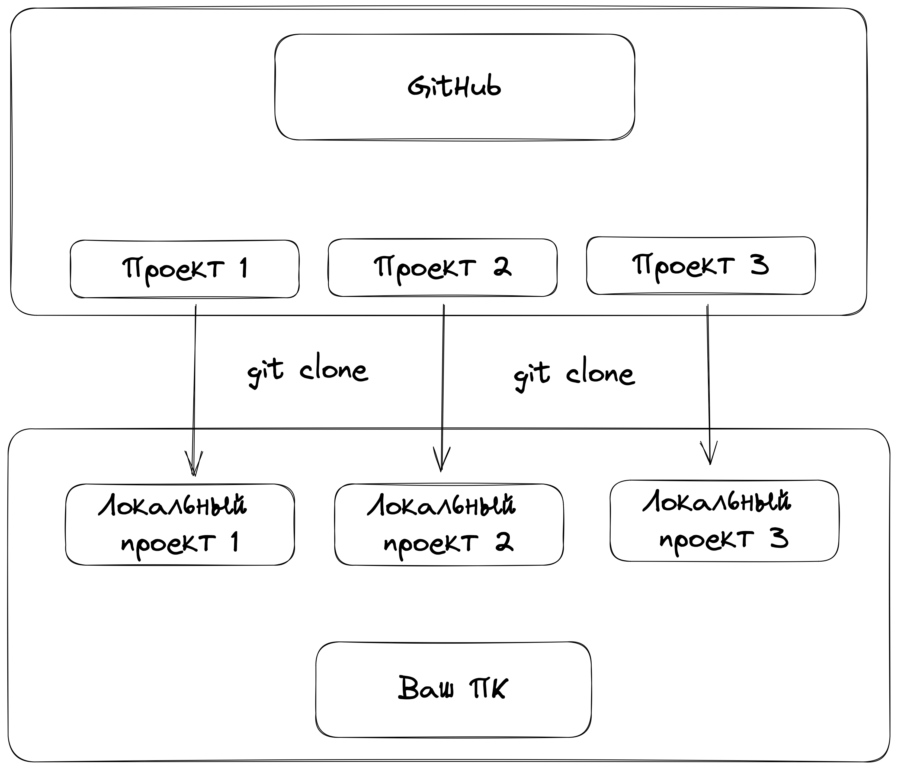
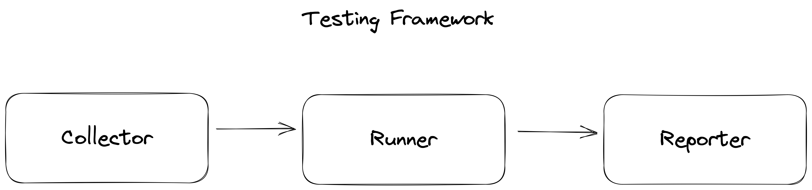

# qa_guru_python_9_2

Эта строчка была добавлена через веб-интерфейс гитхаба1

Эта строчка была добавлена через PyCharm

# Домашняя работа
1. Зарегистрируйте аккаунт на https://github.com
2. Создайте новый проект для домашнего задания https://github.com/new
3. Доработайте тест на поиск в google с первого занятия с Pytest
4. Установите размер браузера с помощью фикстуры Pytest
5. Добавьте еще один тест на поиск, который проверит что поиск не выдает результатов по вашему запросу:
   - вводим строку, по которой не ожидаем результатов (придумайте случайный набор символов)
   - проверяем, что поиск не выдает результатов, и пишет об этом сообщение

Запушьте код в свой репозиторий и дайте на него ссылку в качестве ответа на домашнее задание

## GitHub и локальные проекты

## Типичный тестовый фреймворк

## Дерево фикстур

